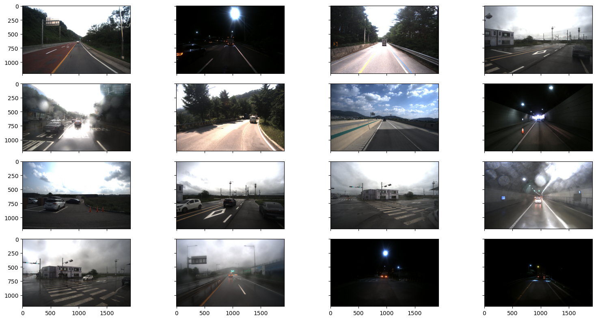
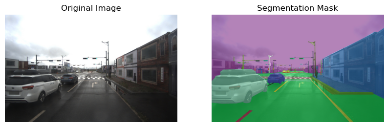
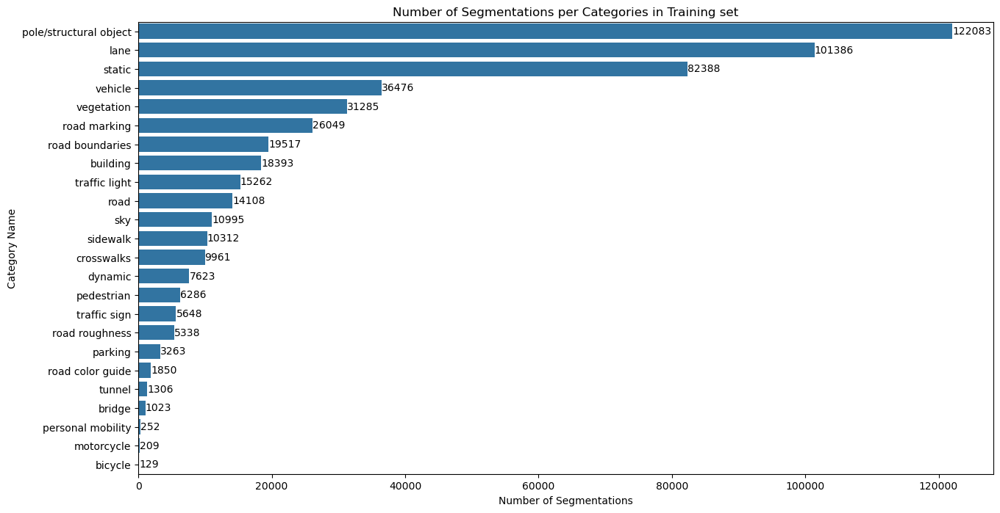
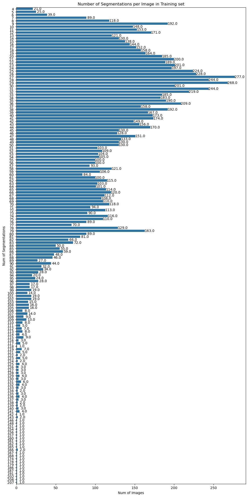
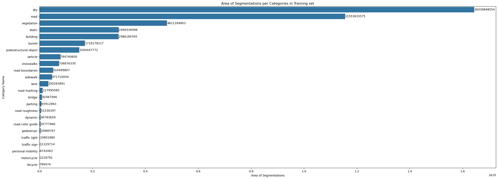

# **Data Preprocessing**

## 0. EDA
### Image Visualization

### Mask Visualization

### Number of Segmenations per Categories in Training set

### Number of Segmenations per Image in Training set

### Area of Segmenations per Categories in Training set


### There are some **IMBALANCE** in data!
## 1. Transform `json` files to `png` files

Dataset's label files consist of `json` polygon coordinates.

To use MMSegmentation, you should transfrom `json` files to `png` mask files.

Lastly, you should form the following file structure.

```
data/2DSS/
├── images/
│   ├── train/
│   │   ├── img1.jpg
│   │   ├── img2.jpg
│   ├── val/
│   │   ├── img3.jpg
│   │   ├── img4.jpg
│   └── test/
│       ├── img5.jpg
│       ├── img6.jpg
└── annotations/
    ├── train/
    │   ├── img1.png
    │   ├── img2.png
    ├── val/
    │   ├── img3.png
    │   ├── img4.png
    └── test/
        ├── img5.png
        ├── img6.png
```

## 2. Match `jpg` file names and `png` file names

There are some files which should match image files with label files but have different names each other.

You should change label files' name which starts **S_DRG\*** to **S_DRR\***.

There are 40 pairs in train dataset, 1 pair in validation dataset, and 3 pairs in test dataset.

## 3. Data Augmentation

Motorcycle, Personal mobility, Vegetation classes have low mIoU scores.

So, we progressed augmentation for these 3 classes.

We cropped images including a target object, and resized images to 1920x1200.